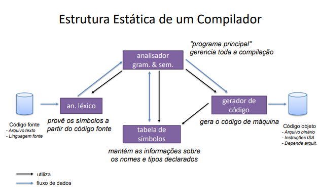

# _3. FCI::Compilers

## O que é faz um Pré-processador em um compilador comercial?
- Remove macros
- Inclui caminhos (paths) de arquivos
- Realiza outras substituições

## O que faz um Compilador dentro de um compilador comercial?
Verifica e compreende o código para então traduzi-lo e e gerar um código equivalente em uma linguagem de baixo nível.

## O que faz um Linker em um compilador comercial?
Reune em um arquivo executavel todos os módilos que compõe o programa, resolvendo referências cruzadas.

## Qual o papel da análise léxica dentro de um compilador?
A análise léxica é um programa que faz a carredura do aquivo fonte reconhecendo e identificando cada um dos elementos significativos da linguagem e eleminando quaisquer caracteres irrelevantes para o processo de compilação.

## Qual o papel da análise sintática dentro de um compilador?
A análise sintática verifica a estrutura do código e analisa se todos os elementos encontrados estão na ordem esperada e determina qual a relação que existe entre eles(contexto).
Como resultado, contrói uma representação estruturada do código que será utilizada no processo de tradução.

## Qual o papel da análise semântica dentro de um compilador?
A análise semântica verifica a natureza dos identificadores, seus tipos e escopo, além da compatibilidade entre os elementos envolvidos nas instruções.

## Qual o papel da geração de código intermediário dentro de um compilador?
Ele sintetiza um código equivalente em linguagem de baixo nível, que mais tarde será optimizado e ainda passar por alguns processos de tratamento.

## Qual o papel da otimização dentro de um compilador?
A otimização é o processo que realiza melhorias no código gerado, buscando optimizar instruções e eliminar trechos sem efeito ou inalcançáveis.

## Qual a diferença de um compilador para um interpretador?
Enquanto um compilador analisa todo o código a fim de traduzi-lo de uma vez (muitas vezes, o resultado é um arquivo executável ou uma biblioteca), o interpretador faz esse trabalho de conversão aos poucos, sempre que uma declaração ou função é executada, por exemplo.

## Em um compilador de duas passagens, que processos o front end realiza?
- Análise Léxica
- Análise Gramatical
- Análise Semântica

## Em um compilador de duas passagens, que processos o back end realiza?
- Geração de código intermediário
- Otimização
- Geração de código final

## Quais as vantagens de um compilador de duas passagens?
- Melhor portabilidade
- Possibilidade de combinações entre front-ends e back-ends
- Otimizações são mais fáceis na representação intermediária do que no código fonte

## Quais as desvantagens de um compilador de duas passagens?
- Lenta
- Necessita de mais memória

## O que é a representação intermediária de um código?
O código resultante da análise somente do front end em um compilador de duas passagens

## Como é a estrutura estática de um compilador?

